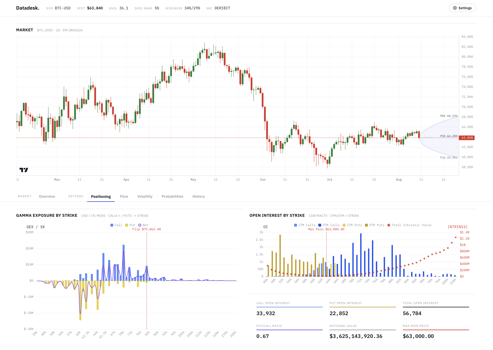

# Overview

Crypto Datadesk is an analytics desk meant as a fast, opinionated read on where the options market is priced and how it is positioned.



See [CHANGELOG.md](CHANGELOG.md) for the full list of views and what each one computes.

## Getting started

Prepare env file:

```sh
cp .env.example .env
```

Run in Docker:

```sh
docker compose up --build
```

Then open **http://localhost:8080**.

Or run each service locally.

Core:

```sh
python3 -m venv .venv
source .venv/bin/activate
pip install -r requirements.txt -r requirements-dev.txt
uvicorn main:server --reload # serves http://localhost:8000
```

Dashboard:

```sh
npm install
npm run dev # serves http://localhost:5173, proxies /api -> :8000
```

Useful commands:

```sh
pytest # core tests
ruff check . && ruff format . # core lint and format
```

```sh
npm test # dashboard typecheck and tests
npm run lint:fix # dashboard lint and format
```

## API

API docs are available at http://localhost:8000/docs.
